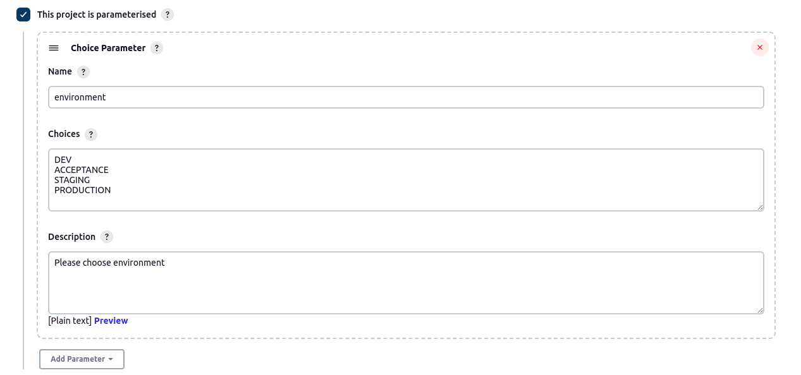
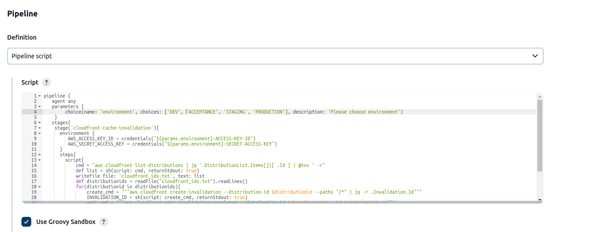

# Cloudfront - Automating the cloudfront cache invalidation using Jenkins pipeline

- [Cloudfront](#cloudfront)
   - [Overview](#overview)
   - [Pre-requisites](#pre-requisites)
   - [Setup](#setup)
       - [Creating jenkins job](#creating-jenkins-job)
       - [Executing jenkins job](#executing-jenkins-job)
       

## Cloudfront
### Overview

Cloudfront stores the cache at edge locations. This Cache will be expired/removed automatically after it lapse the duration/cache period(which will be specified while creating distribution). However sometimes you need to delete the cache before it gets expired on its own. This can be done in multiple ways.

- Via AWS Console
- AWS CLI
- Jenkins pipeline

In this tutorial we are going to use jenkins pipeline to remove the cache.

### Pre-requisites

- Jenkins should be already up & running
- Jenkins agent should already consist of aws & jq utilities. Because our pipeline is going to use these utilities.
- Credentials(aws accesskey & aws secret access key) should be created before executing the pipeline. Our pipeline targets multiple environment(DEV, ACCEPTANCE, STAGING, PRODUCTION). For example if you want to target DEV environment's cloudfronts then you should create credentials with the following naming conventions.

steps & naming convention to create credentials are as follows.

**for AWS ACCESS KEY**

Jenkins -> Manage Jenkins -> Manage Credentials -> Selecy System(Global) -> Add Credentials -> choose `Secret Text` from dropdown -> Enter accesskey value under `Secret` column -> enter id value as <ENVIRONMENT>-ACCESS-KEY-ID(for ex: DEV-ACCESS-KEY-ID ) -> Description as "DEV-AWS-ACCESS-KEY-ID.

**for AWS SECRET ACCESS KEY**

Jenkins -> Manage Jenkins -> Manage Credentials -> Selecy System(Global) -> Add Credentials -> choose `Secret Text` from dropdown -> Enter secretkey value under `Secret` column -> enter id value as <ENVIRONMENT>-SECRET-ACCESS-KEY(for ex: DEV-SECRET-ACCESS-KEY ) -> Description as "DEV-AWS-SECRET-ACCESS-KEY.

**Note** Repeat this process for all environments.

Sample screenshot below for reference.

### Setup

#### Creating jenkins job

Steps to create jenkins job as follows.

Jenkins Dashboard -> Click `New Item` -> Provide Job name as `cloudfront cache invalidation` -> Select Job type as `Pipeline` -> provide Description as 'cloudfront cache invalidation' -> Select `This Project is parameterised` under this choose `choice parameter` under this provide name as `environment` under choices(DEV ACCEPTANCE etc etc.. Note each entry should be specified on new line) -> provide description as "please choose environment" -> Under Pipeline choose pipeline script from `definition` dropdown and paste the content from this [file](./Jenkinsfile).

Sample screenshots below for reference.

#### Executing jenkins job

Steps to execute the jenkins job as follows.

Jenkins Dashboard -> Select Job -> Click `Build with parameters` -> Choose the environment from the dropdown -> Select `Build`

**Note** Based on the environment that choose above, respective account(for ex: dev account) cloudfronts cache will be invalidated.